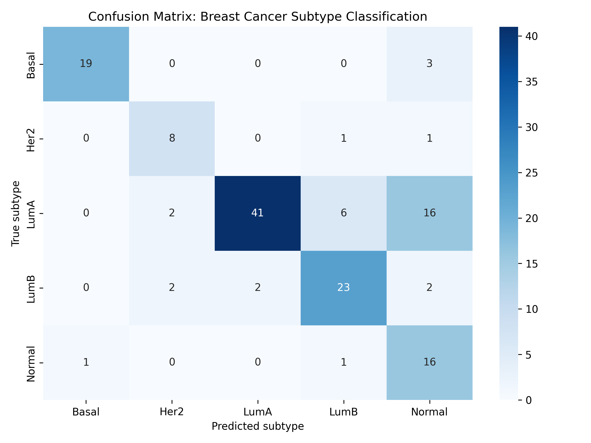
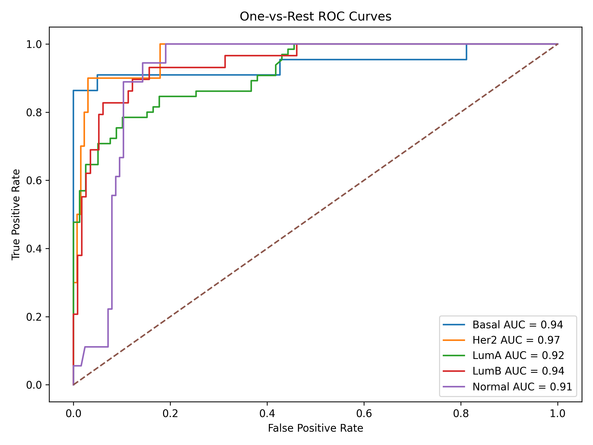
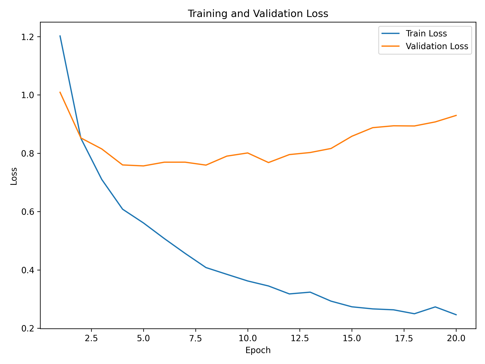
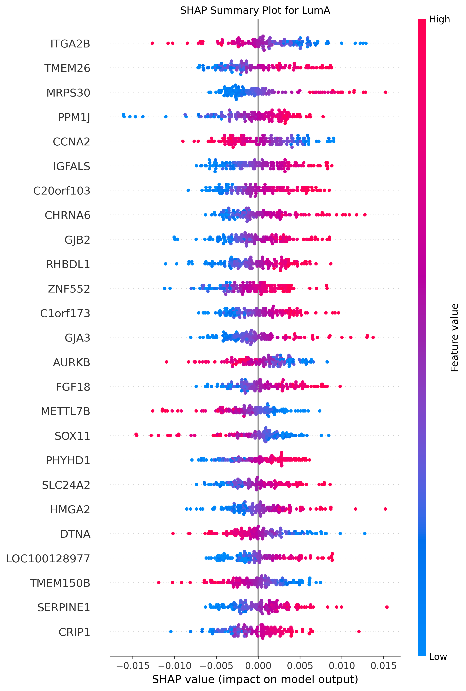

# 🧬 Deep Learning for Breast Cancer Subtype Classification Using TCGA RNA-seq Data (PyTorch)

## Overview
This project develops an end-to-end deep learning pipeline to classify breast cancer molecular subtypes using TCGA RNA-seq gene expression data. The goal is to integrate machine learning with transcriptomic analysis to understand subtype-specific gene expression patterns and identify biologically meaningful predictive genes.

Breast cancer subtypes considered:
- Luminal A (LumA)
- Luminal B (LumB)
- HER2-enriched (Her2)
- Basal-like (Basal)
- Normal-like (Normal)

---

## ⚙️ Pipeline

Raw RNA-seq Data (TCGA Xena)  
↓  
Preprocessing & Normalization  
↓  
Feature Selection (Top 5000 genes)  
↓  
Clinical Label Integration (PAM50)  
↓  
Deep Learning Model (PyTorch)  
↓  
Evaluation (ROC, F1, Confusion Matrix)  
↓  
Interpretability (SHAP)

---

## 📊 Results

### 🔹 Confusion Matrix


### 🔹 ROC Curves


### 🔹 Training Loss


### 🔹 SHAP Interpretation


---

## 📈 Performance
- Accuracy: ~74%  
- Macro F1-score: ~0.74  
- ROC-AUC: >0.90 across all subtypes  

### 🔍 Key Observations
- Strong classification performance for **Basal** and **LumB** subtypes  
- Misclassification observed between **Luminal A** and **Normal** subtypes due to biological similarity  
- High ROC-AUC indicates strong separability of transcriptomic patterns  

---

## Model Architecture
- Fully connected neural network (PyTorch)  
- Batch normalization with dropout regularization  
- AdamW optimizer with learning rate scheduling  
- Early stopping to prevent overfitting  
- Class imbalance handled using weighted loss  

---

## 🧬 Biological Insights (SHAP)

SHAP analysis identified key genes contributing to subtype classification:

- **ESR1** – estrogen receptor signaling (Luminal subtypes)  
- **CCNA2** – cell cycle regulation  
- **AURKB** – mitotic activity  
- **GREB1** – hormone-responsive gene  

These results indicate that the model captures biologically meaningful gene expression patterns rather than random noise.

---

## Limitations
- Overfitting observed after early epochs due to high-dimensional RNA-seq data  
- Moderate confusion between Luminal A and Normal subtypes  
- Limited sample size relative to feature space  

---

## 📂 Project Structure

scripts/ # preprocessing, training, evaluation, SHAP
figures/ # plots (ROC, confusion matrix, SHAP)
results/ # metrics, predictions, gene importance
data/ # not included (see below)
README.md


---

## 📥 Data
Data is publicly available from TCGA (UCSC Xena):

🔗 https://xena.ucsc.edu/

Required files:
- TCGA.BRCA.sampleMap/HiSeqV2  
- TCGA.BRCA.sampleMap/BRCA_clinicalMatrix  

Place them in:

data/raw/


---

## ▶️ Reproducibility

Run the full pipeline:

```bash
python scripts/01_preprocess_tcga.py
python scripts/02_merge_labels.py
python scripts/03_train_model.py
python scripts/04_evaluate_model.py
python scripts/05_shap_interpretation.py
--> Skills Demonstrated
Deep learning for genomic data
High-dimensional RNA-seq analysis
Model evaluation and validation
Explainable AI (SHAP)
Data preprocessing and feature engineering
Biological interpretation of machine learning models
Impact

This project demonstrates the integration of deep learning with transcriptomic data to classify cancer subtypes and identify potential biomarkers, highlighting the importance of combining computational modeling with biological interpretation.

👤 Author

Divya Reddy
MS Bioinformatics, Georgia Institute of Technology
